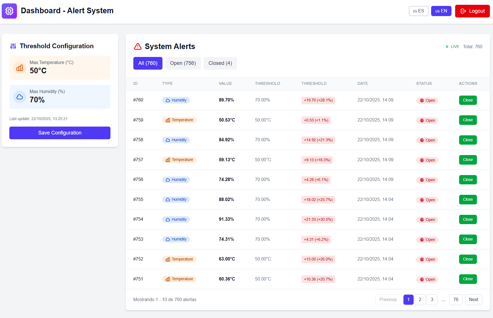

# 🏭 Sistema de Alertas de Automatización Industrial

Sistema full-stack de monitoreo en tiempo real para sensores industriales con notificaciones instantáneas mediante SignalR/WebSockets.


## 🎯 Características

- 🔐 **Autenticación JWT** - Sistema seguro de login
- 📊 **Dashboard en tiempo real** - Actualizaciones automáticas con SignalR
- ⚙️ **Configuración dinámica** - Ajuste de umbrales de temperatura y humedad
- 🌡️ **Simulación de sensores** - Generación automática de datos cada 4 segundos
- 📈 **Gestión de alertas** - Filtrado, paginación y reconocimiento
- 🔴 **Live updates** - Sin necesidad de recargar la página

## 🏗️ Stack Tecnológico

### Backend
- ASP.NET Core 8 Web API
- Entity Framework Core 9.0.10
- PostgreSQL 15
- JWT Bearer Authentication
- SignalR para WebSockets
- Clean Architecture (Domain → Infrastructure → Api)

### Frontend
- Next.js 16.0.0 (App Router + Turbopack)
- TypeScript
- TailwindCSS
- TanStack Query (React Query)
- @microsoft/signalr

## 📁 Estructura del Proyecto

```
GreenSpec/
├── backend/                          # Backend ASP.NET Core
│   ├── AlertService.Domain/          # Entidades e interfaces
│   ├── AlertService.Infrastructure/  # EF Core, Repositories, Services
│   ├── AlertService.Api/             # Controllers, Hubs, DTOs
│   └── AlertService.sln              # Solución de Visual Studio
│
├── frontend/                         # Frontend Next.js
│   ├── app/                          # Páginas (login, dashboard)
│   ├── components/                   # Componentes React
│   ├── lib/                          # API client y hooks
│   └── types/                        # Definiciones TypeScript
│
└── README.md                         # Este archivo
```

## 🚀 Inicio Rápido

### Prerrequisitos

- [.NET 8 SDK](https://dotnet.microsoft.com/download/dotnet/8.0)
- [Node.js 18+](https://nodejs.org/)
- [Docker Desktop](https://www.docker.com/products/docker-desktop/) (recomendado para PostgreSQL)

### 1️⃣ Base de Datos con Docker

```bash
# Crear y ejecutar contenedor PostgreSQL
docker run --name greenspec-postgres \
  -e POSTGRES_USER=postgres \
  -e POSTGRES_PASSWORD=postgres \
  -e POSTGRES_DB=alertservice \
  -p 5432:5432 \
  -d postgres:15

# Verificar que esté corriendo
docker ps

# Iniciar en el futuro (si ya existe)
docker start greenspec-postgres

# Detener
docker stop greenspec-postgres
```

### 2️⃣ Backend

```bash
# Navegar a la carpeta del backend
cd backend/AlertService.Api

# Aplicar migraciones (crear tablas)
dotnet ef database update --project ../AlertService.Infrastructure

# Ejecutar el backend
dotnet run
```

El backend estará disponible en: **http://localhost:5046**

### 3️⃣ Frontend

**Abrir nueva terminal:**

```bash
# Navegar a la carpeta del frontend
cd frontend

# Instalar dependencias (solo la primera vez)
npm install

# Ejecutar en modo desarrollo
npm run dev
```

El frontend estará disponible en: **http://localhost:3000**

### 4️⃣ Acceder a la Aplicación

1. Abrir http://localhost:3000
2. Iniciar sesión con:
   - **Usuario:** `demo`
   - **Contraseña:** `demo`
3. ¡Listo! Verás el dashboard con alertas en tiempo real

## 📊 Funcionalidades Principales

### Dashboard
- **Indicador Live:** Muestra el estado de conexión SignalR (🟢 Live / 🟡 Conectando / 🔴 Desconectado)
- **Total de alertas:** Contador en tiempo real
- **Filtros:** Todas / Abiertas / Reconocidas
- **Paginación:** 10 alertas por página con navegación inteligente

### Configuración de Umbrales
- **Temperatura Máxima:** Configurable en °C
- **Humedad Máxima:** Configurable en %
- **Actualización en vivo:** Los cambios aplican inmediatamente al simulador

### Tabla de Alertas
Columnas:
- ID de la alerta
- Tipo (Temperatura 🌡️ / Humedad 💧)
- Valor detectado
- Umbral configurado
- Exceso (valor y porcentaje)
- Fecha y hora
- Estado (Abierta 🔴 / Reconocida ✅)
- Acción (botón "Reconocer")

## 🔧 API Endpoints

### Autenticación
```http
POST http://localhost:5046/auth/login
Content-Type: application/json

{
  "username": "demo",
  "password": "demo"
}
```

### Configuración
```http
# Obtener configuración
GET http://localhost:5046/config
Authorization: Bearer {token}

# Actualizar umbrales
PUT http://localhost:5046/config
Authorization: Bearer {token}
Content-Type: application/json

{
  "tempMax": 60.0,
  "humidityMax": 75.0
}
```

### Alertas
```http
# Listar alertas
GET http://localhost:5046/alerts
Authorization: Bearer {token}

# Reconocer alerta
POST http://localhost:5046/alerts/123/acknowledge
Authorization: Bearer {token}
```

### SignalR Hub
- **Endpoint:** `ws://localhost:5046/hubs/alerts`
- **Evento:** `ReceiveNewAlert`
- **Transporte:** WebSockets con fallback a Long Polling

## 🧪 Tests

El proyecto incluye **33 tests unitarios** que cubren:

### Controllers
- **AuthController**: 5 tests (login válido, credenciales inválidas, validaciones)
- **ConfigController**: 5 tests (obtener config, validaciones de umbrales)
- **AlertsController**: 7 tests (listar, obtener por ID, reconocer, validaciones)

### Repositories
- **ConfigRepository**: 3 tests (CRUD operations con InMemory DB)
- **AlertRepository**: 5 tests (crear, listar ordenado, obtener, actualizar estado)

### Entities
- **Alert y Config**: 8 tests (propiedades, constantes, valores por defecto)

### Ejecutar Tests

```bash
cd backend
dotnet test
```

**Resultado esperado**: `33 tests passed` ✅

---

## 🐛 Troubleshooting

### El backend no inicia
- Verifica que PostgreSQL esté corriendo: `docker ps`
- Verifica que el puerto 5046 no esté en uso

### El frontend no se conecta a SignalR
- Verifica que el backend esté corriendo
- Revisa la consola del navegador (F12)
- El error inicial de negociación es normal, se reconecta automáticamente

### Error "Failed to connect to database"
- Verifica la cadena de conexión en `backend/AlertService.Api/appsettings.json`
- Asegúrate de que PostgreSQL esté corriendo en el puerto 5432

### No aparecen alertas
- El simulador genera alertas cada 4 segundos
- Verifica que los umbrales estén configurados (por defecto: Temp 50°C, Humedad 70%)
- Los valores aleatorios deben superar los umbrales para generar alertas

## 🛠️ Comandos Útiles

### Docker
```bash
# Ver contenedores corriendo
docker ps

# Ver logs de PostgreSQL
docker logs greenspec-postgres

# Reiniciar PostgreSQL
docker restart greenspec-postgres

# Eliminar contenedor
docker rm -f greenspec-postgres
```

### Backend
```bash
cd backend/AlertService.Api

# Compilar sin ejecutar
dotnet build

# Crear nueva migración
dotnet ef migrations add NombreMigracion --project ../AlertService.Infrastructure

# Revertir última migración
dotnet ef database update NombreMigracionAnterior --project ../AlertService.Infrastructure
```

### Frontend
```bash
cd frontend

# Compilar para producción
npm run build

# Iniciar versión de producción
npm start

# Limpiar caché
npm run clean
```

## 📦 Dependencias Principales

### Backend
- `Microsoft.EntityFrameworkCore` 9.0.10
- `Npgsql.EntityFrameworkCore.PostgreSQL` 9.0.4
- `Microsoft.AspNetCore.Authentication.JwtBearer` 8.0.0
- `Microsoft.AspNetCore.SignalR` (incluido en ASP.NET Core)

### Frontend
- `next` 16.0.0
- `react` 19.0.0
- `@tanstack/react-query` 5.62.8
- `@microsoft/signalr` 8.0.7
- `axios` 1.7.9
- `tailwindcss` 3.4.17

## 📝 Notas de Desarrollo

- **Credenciales demo:** Hardcodeadas en `backend/AlertService.Api/Controllers/AuthController.cs`
- **Simulador:** Genera valores aleatorios entre 30-70°C y 50-100% cada 4 segundos
- **SignalR:** Notifica a todos los clientes conectados cuando se genera una alerta
- **Paginación:** 10 items por página, configurable en `frontend/components/AlertsTable.tsx`

---

## 👨‍💻 Autor

**Daniel Steven Diaz**

Sistema de monitoreo industrial desarrollado con ASP.NET Core, Next.js y SignalR.
